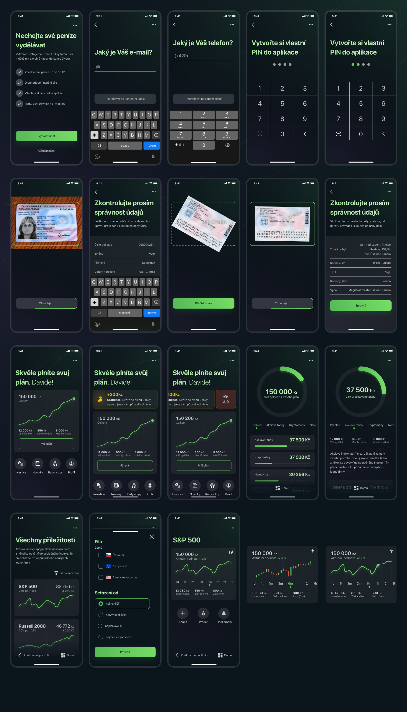
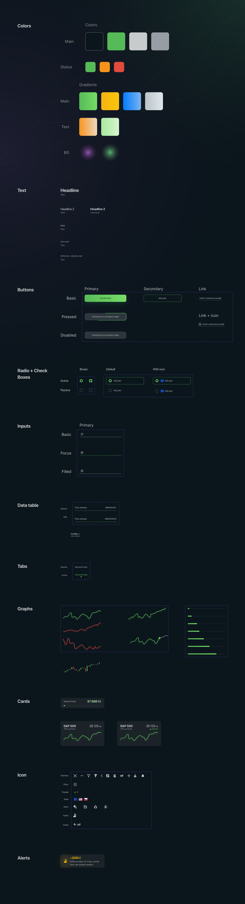

# Investing money when you are young

**What problem did the project solve?**

A lot of young people don't invest money in their future. They think, that it is not important and They live presence. Their thinking is not long-term but short-term. This project should change their mind and explain why it is good to think in the long-term.

**Who is our user?**

Our ideal user is a young person under 35 years of age. It doesn't matter if it's a boy or a girl. However, it is essential to have a regular income. Thanks to the fact that it is possible to invest up to CZK 100 per month, it does not matter how much, but especially the regularity. At best, he is set up as someone who thinks about his future and is not indifferent to him.

**What does the solution look like?**

As a solution, I decided to create a mobile application. Application will help young people invest, understand the overall theme and prepare for passive income. The application offers investment in stocks, real estate, cryptocurrencies, or index funds. He will compile a plan tailored to the user, who will be supervise by a team of experienced investment advisers. Users will then be rewarde for following the plans. At the same time, in the application, you will find various hints and tips that will help you change your view of this issue.

**How the application will earn?**

The application earns money from the creation of plans and fees for the purchase of individual funds, shares, or cryptocurrencies. Each transaction can take a tenth or one-hundredth of a percent, which then earns a large number of transactions for application development. The user thus practically does not know the difference when purchasing, but he is notified of everything and can find all transactions, including fees, in the statement.

**Styles**

