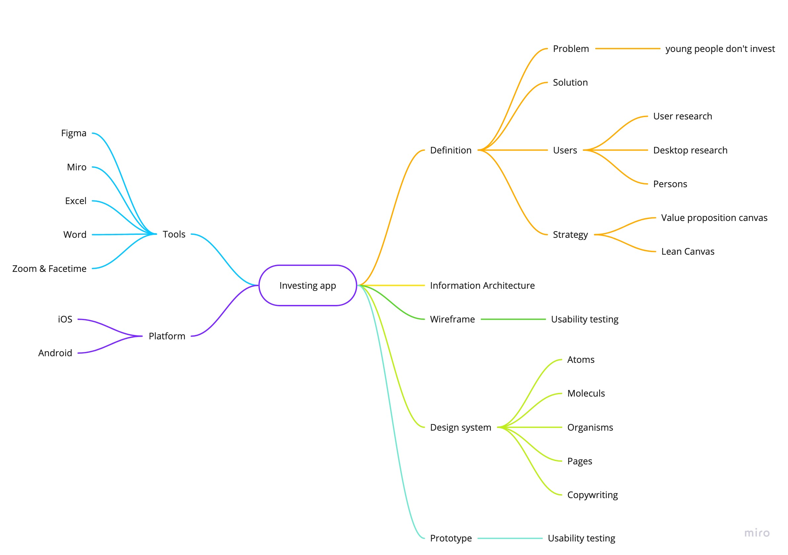

# Investing mobile app

A lot of young people don't invest money in their future. They think, that it is not important and They live presence. Their thinking is not long-term but short-term. This project should change their mind and explain why it is good to think in the long-term and investing.

  
Mind Map

  

### Voice & Tone

<!-- For example. See Recap section links for review. -->

- **Voice:** 
1. Simple
2. Friendly
3. Ambitious
- **Tone:** 
1. Upbeat
2. Respectful
3. Enthusiastic
4. Discover

## Outline

1. Key point; aim for a single-sentence in 120 characters or less.
2. Key point; aim for a single-sentence in 120 characters or less.
3. Key point; aim for a single-sentence in 120 characters or less.
4. Key point; aim for a single-sentence in 120 characters or less.
5. Key point; aim for a single-sentence in 120 characters or less.
6. Another key point?
7. Too long, didn’t read?

### Notes

- …
- …
- …

## Keywords

- **Keyword**
1. Wireframe
2. User experience
3. User interface
4. Design system
5. User flow
6. Analysis 
7. Investing

### References

<!-- Consider reference style for textual works, data sets, and audiovisual and online media. -->

- [APA Style Reference Examples](https://apastyle.apa.org/style-grammar-guidelines/references/examples)
- [Reference](http://)
- [Reference](http://)
